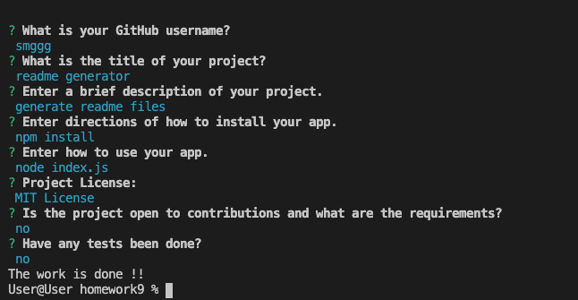

# readme generator

generate readme files

## Table of contents
[readme generator](#readme-generator.md)

[Installation](#installation)

[Usage](#usage)

[License](#license)

[Contributing](#contributing)

[Tests](#tests)

[Questions](#questions)

## Installation
npm install

## Usage
node index.js

## License
MIT License

## Contributing
no

## Test
no

## Questions
For any questions, they can be can be sent to the repo owner [smggg](https://github.com/smggg)

